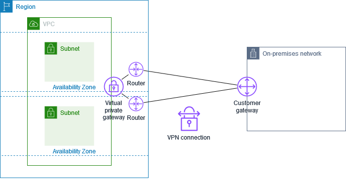

# LAB3 Multi-Region AWS Architecture with Transit Gateway

This project implements a multi-region AWS infrastructure across Tokyo (ap-northeast-1) and São Paulo (sa-east-1) connected via AWS Transit Gateway with inter-region peering.

## Architecture Overview

### Regional Separation
- **Global**: Route53 + CloudFront + edge WAF + global logging
- **Tokyo (Primary)**: Contains secure services (database, VPC hub)
- **São Paulo (Spoke)**: Compute-focused infrastructure connecting to Tokyo database
- **Modular Design**: Reusable modules for IAM, monitoring, and S3 logging

### Key Components

#### Global (us-east-1 + Route53)
- **Route53**: Apex + app + origin records
- **CloudFront**: Global CDN and TLS
- **Edge WAF**: WAFv2 Web ACL for CloudFront

#### Tokyo (ap-northeast-1)
- **VPC**: `10.0.0.0/16` (Primary hub)
- **Transit Gateway**: Hub for inter-region connectivity
- **Database**: Aurora MySQL cluster (secure, Tokyo-only)
- **Application**: Auto-scaling EC2 with ALB
- **Modules**: Regional IAM, S3 logging, monitoring

#### São Paulo (sa-east-1)  
- **VPC**: `10.234.0.0/16` (Non-overlapping spoke)
- **Transit Gateway**: Spoke connecting to Tokyo
- **Compute**: Auto-scaling EC2 fleet accessing Tokyo database
- **Application**: Load-balanced web tier
- **Modules**: Same regional modules as Tokyo

## Directory Structure

```
LAB3/
├── global/                   # Global stack (Route53 + CloudFront + edge WAF)
│   ├── providers.tf
│   ├── cloudfront.tf
│   ├── route53.tf
│   ├── waf.tf
│   ├── outputs.tf
│   └── backend.tf
├── Tokyo/                     # Tokyo region (primary + secure services)
│   ├── main.tf               # VPC, TGW hub, ALB, EC2, modules
│   ├── database.tf           # Aurora MySQL cluster
│   ├── global-iam.tf         # Cross-region IAM roles
│   ├── userdata.sh           # EC2 initialization script
│   ├── outputs.tf            # Outputs for remote state
│   ├── variables.tf          # Region-specific variables
│   └── backend.tf            # S3 remote state config
├── saopaulo/                 # São Paulo region (compute spoke)
│   ├── main.tf               # VPC, TGW spoke, ALB, EC2, modules
│   ├── outputs.tf            # Outputs for remote state
│   ├── variables.tf          # Region-specific variables
│   └── backend.tf            # S3 remote state config
├── terraform_startup.sh      # Apply wrapper (Tokyo -> global -> saopaulo)
├── terraform_destroy.sh      # Destroy wrapper (global -> Tokyo -> saopaulo)
└── modules/                  # Shared reusable modules
    ├── regional-iam/         # IAM roles and policies
    ├── regional-monitoring/  # CloudWatch and SNS
    └── regional-s3-logging/  # S3 buckets for logs
```

## Module Architecture

### Regional IAM Module
- **Purpose**: Standardized EC2 roles with conditional database access
- **Features**: SSM, CloudWatch, optional database permissions
- **Cross-Region**: Tokyo role can assume São Paulo resources

### Regional Monitoring Module
- **Purpose**: CloudWatch logs, alarms, and SNS topics
- **Features**: Application/system log groups, CPU/disk monitoring
- **Regional**: Independent monitoring per region

### Regional S3 Logging Module
- **Purpose**: S3 buckets for ALB and application logs
- **Features**: Lifecycle policies, encryption, proper bucket policies
- **Compliance**: Regional data residency

## Transit Gateway Design

### Peering Configuration
1. **Tokyo initiates** peering to São Paulo
2. **São Paulo accepts** the peering connection
3. **Route tables** configured for cross-region database access
4. **Security groups** allow MySQL (3306) between regions

### Network Flow
```
São Paulo App Servers → São Paulo TGW → TGW Peering → Tokyo TGW → Tokyo Database
```

## Deployment Process

### Prerequisites
1. AWS CLIs configured for both regions
2. S3 buckets for Terraform state in each region
3. Key pairs created in both regions
4. Update backend configurations with actual bucket names

### State Locking Options
Default backend mode in this repo uses S3 lock files (`use_lockfile = true`).

Optional activation (team/CI): enable DynamoDB locking.
1. Create the lock table in both regions:
```bash
aws dynamodb create-table \
  --table-name taaops-terraform-state-lock \
  --attribute-definitions AttributeName=LockID,AttributeType=S \
  --key-schema AttributeName=LockID,KeyType=HASH \
  --billing-mode PAY_PER_REQUEST \
  --region ap-northeast-1

aws dynamodb create-table \
  --table-name taaops-terraform-state-lock \
  --attribute-definitions AttributeName=LockID,AttributeType=S \
  --key-schema AttributeName=LockID,KeyType=HASH \
  --billing-mode PAY_PER_REQUEST \
  --region sa-east-1
```
2. Add this to each backend: `Tokyo/backend.tf`, `global/backend.tf`, `saopaulo/backend.tf`
```hcl
dynamodb_table = "taaops-terraform-state-lock"
```
3. Reinitialize:
```bash
(cd Tokyo && terraform init -reconfigure)
(cd global && terraform init -reconfigure)
(cd saopaulo && terraform init -reconfigure)
```

Note: Use one locking method at a time (`use_lockfile` or `dynamodb_table`).

### Deployment (Recommended)
Run from `LAB3` root:
```bash
bash ./terraform_startup.sh
```

Windows Line Endings Fix (if scripts fail with /usr/bin/env)
```bash
sed -i 's/\r$//' terraform_startup.sh terraform_apply.sh
```

Deployment order in script:
1. `Tokyo`
2. `global`
3. `saopaulo`

### Destroy (Recommended)
Run from `LAB3` root:
```bash
bash ./terraform_destroy.sh
```

Destroy order in script:
1. `global`
2. `Tokyo`
3. `saopaulo`

### Manual Alternative
```bash
# Apply
(cd Tokyo && terraform init -upgrade && terraform plan && terraform apply)
(cd global && terraform init -upgrade && terraform plan && terraform apply)
(cd saopaulo && terraform init -upgrade && terraform plan && terraform apply)

# Destroy
(cd global && terraform destroy)
(cd Tokyo && terraform destroy)
(cd saopaulo && terraform destroy)
```

### Verify Connectivity
```bash
# Test database connectivity from São Paulo instances
# Check TGW route tables
# Verify ALB health checks
```

## Security Architecture

### IAM Strategy
- **Global IAM in Tokyo**: Cross-region roles and policies
- **Regional Modules**: Local EC2 roles with database access
- **Principle of Least Privilege**: Minimal permissions per service

### Network Security
- **VPC Isolation**: Non-overlapping CIDR blocks
- **Security Groups**: Granular port/protocol restrictions
- **Database Access**: TGW-only, no public endpoints
- **Encryption**: In transit and at rest

### Data Protection
- **Database**: Aurora MySQL with encryption
- **Secrets**: AWS Secrets Manager for credentials
- **S3**: Server-side encryption for logs
- **KMS**: Customer-managed keys for sensitive data

## Monitoring and Logging

### CloudWatch Integration
- **Application Logs**: Centralized per region
- **System Logs**: OS and infrastructure metrics
- **Custom Dashboards**: Regional performance views

### Alerting
- **SNS Topics**: Regional alert distribution
- **CloudWatch Alarms**: CPU, disk, memory thresholds
- **Auto Scaling**: Reactive scaling based on demand

Optional Alerting
- Tokyo RDS flow log alerting is gated by `enable_rds_flowlog_alarm` in [Tokyo/variables_aws_gcp_tgw.tf](Tokyo/variables_aws_gcp_tgw.tf); default is off.

### 🔐 ACM Certificates
- **CloudFront**: ACM certificate in us-east-1 for the public CNAMEs.
- **Tokyo ALB Origin**: Separate ACM certificate in ap-northeast-1 for the origin hostname.
- **GCP Internal ILB**: CAS-issued certificate for the internal HTTPS endpoint.
  - CAS pool: `nihonmachi-cas-pool` (us-central1)
  - CA: `nihonmachi-root-ca`
  - Common name/SAN: `nihonmachi.internal.jastek.click`
  - ILB IP: output `nihonmachi_ilb_ip` in [newyork_gcp/outputs.tf](newyork_gcp/outputs.tf#L9-L12)

### Tunnel Rotation References



- AWS Site-to-Site VPN tunnel changes: https://docs.aws.amazon.com/vpn/latest/s2svpn/modify-vpn-connection.html
- AWS VPN tunnel options: https://docs.aws.amazon.com/vpn/latest/s2svpn/VPNTunnels.html
- GCP HA VPN concepts: https://cloud.google.com/network-connectivity/docs/vpn/concepts/ha-vpn
- GCP HA VPN with Cloud Router: https://cloud.google.com/network-connectivity/docs/router/how-to/creating-ha-vpn
- GCP VPN monitoring: https://cloud.google.com/network-connectivity/docs/vpn/how-to/monitor-vpn
  - Private DNS: A record in [Tokyo/route53-private-ilb.tf](Tokyo/route53-private-ilb.tf#L9-L22)

## Module Usage Examples

### Using Regional IAM Module
```hcl
module "regional_iam" {
  source = "../modules/regional-iam"
  
  region = "sa-east-1"
  database_access_enabled = true  # For São Paulo apps
  common_tags = local.common_tags
}
```

### Using S3 Logging Module
```hcl
module "s3_logging" {
  source = "../modules/regional-s3-logging"
  
  region = var.aws_region
  common_tags = local.common_tags
}

# Reference in ALB
access_logs {
  bucket  = module.s3_logging.alb_logs_bucket_id
  prefix  = "regional-alb"
  enabled = true
}
```

## Remote State Dependencies

### Tokyo Exports (for São Paulo consumption)
- `database_endpoint`: Aurora cluster endpoint
- `database_secret_arn`: Secrets Manager ARN
- `tokyo_sao_peering_id`: TGW peering attachment ID
- `tokyo_transit_gateway_id`: TGW hub ID

### São Paulo Exports (for Tokyo consumption)  
- `saopaulo_transit_gateway_id`: TGW spoke ID
- `vpc_cidr`: For routing configuration
- `alb_dns_name`: Application endpoints

## Customization Points

### Terraform Remote State
[terraform_remote_state](https://developer.hashicorp.com/terraform/language/state/remote-state-data)

The terraform_remote_state data source uses the latest state snapshot from a specified state backend to retrieve the root module output values from some other Terraform configuration.

You can use the terraform_remote_state data source without requiring or configuring a provider. It is always available through a built-in provider with the source address terraform.io/builtin/terraform. That provider does not include any other resources or data sources.

Important: We recommend using the tfe_outputs data source in the HCP Terraform/Enterprise Provider to access remote state outputs in HCP Terraform or Terraform Enterprise. The tfe_outputs data source is more secure because it does not require full access to workspace state to fetch outputs.

How we use it in this repo
- Tokyo reads Sao Paulo state for TGW peering IDs and routes.
- Sao Paulo reads Tokyo state for TGW/VPC IDs and DB endpoints/secrets.
- Global reads Tokyo state for ALB/Route53/WAF origin protection.

Remote state is used for infrastructure IDs and wiring.
Runtime configuration is shared through managed services like Route53, S3, SSM Parameter Store, and Secrets Manager.

#### Alternative Ways to Share Data Between Configurations
When possible, we recommend explicitly publishing data for external consumption to a separate location instead of accessing it via remote state. This lets you apply different access controls for shared information and state snapshots.

To share data explicitly between configurations, you can use pairs of managed resource types and data sources in various providers, including (but not limited to) the following:

| System | Publish with... | Read with... |
| --- | --- | --- |
| DNS (IP addresses and hostnames) | `aws_route53_record` | Normal DNS lookups, or the `dns` provider |
| Amazon S3 | `aws_s3_object` | `aws_s3_object` data source |
| Amazon SSM Parameter Store | `aws_ssm_parameter` | `aws_ssm_parameter` data source |
| Azure Automation | `azurerm_automation_variable_string` | `azurerm_automation_variable_string` data source |
| Azure DNS (IP addresses and hostnames) | `azurerm_dns_a_record` (and similar) | Normal DNS lookups, or the `dns` provider |
| Google Cloud DNS (IP addresses and hostnames) | `google_dns_record_set` | Normal DNS lookups, or the `dns` provider |


A key advantage of using a separate explicit configuration store instead of terraform_remote_state is that the data can potentially also be read by systems other than Terraform, such as configuration management or scheduler systems within your compute instances. For that reason, we recommend selecting a configuration store that your other infrastructure could potentially make use of. For example:

If you wish to share IP addresses and hostnames, you could publish them as normal DNS A, AAAA, CNAME, and SRV records in a private DNS zone and then configure your other infrastructure to refer to that zone so you can find infrastructure objects via your system's built-in DNS resolver.


### Variables to Update
1. **backend.tf**: S3 bucket names and regions
2. **variables.tf**: Key pair names, AMI IDs
3. **terraform.tfvars**: Environment-specific values

### Regional Differences
- **AMI IDs**: Different per region
- **Availability Zones**: Region-specific AZ names
- **Instance Types**: Regional availability varies

## Troubleshooting

### Common Issues
1. **State conflicts**: Ensure separate S3 buckets/keys
2. **TGW peering failures**: Deploy Tokyo first
3. **Database connectivity**: Check security groups and routes
4. **Module errors**: Verify module source paths

### Debug Commands
```bash
# Check TGW peering status
aws ec2 describe-transit-gateway-peering-attachments

# Verify route tables
aws ec2 describe-route-tables

# Check security groups
aws ec2 describe-security-groups
```

## Cost Optimization

### Multi-Region Considerations
- **TGW charges**: Per attachment and data transfer
- **Cross-region data**: Significant for high volume
- **Double ALB costs**: Load balancers in both regions
- **Aurora regional**: Consider read replicas vs full cluster

### Recommendations
- **Spot instances**: For development environments
- **Scheduled scaling**: Scale down during off-hours
- **Reserved capacity**: For predictable workloads
- **Log retention**: Set appropriate retention periods

## Next Steps

### Recommended Enhancements
1. **HTTPS termination**: Add SSL certificates to ALBs
2. **CloudFront integration**: Global CDN with both regions
3. **Database replication**: Cross-region Aurora replicas
4. **Auto-failover**: Health check-based region switching
5. **CI/CD integration**: Automated deployment pipelines
