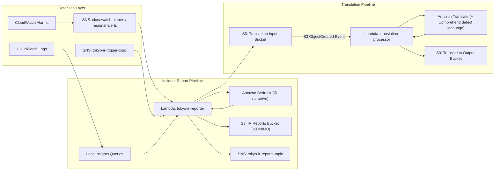
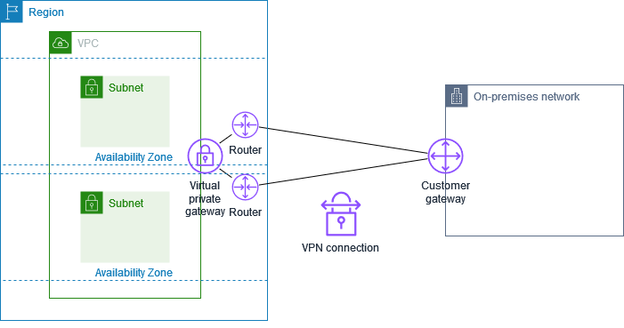

# LAB4 Multi-Region AWS Architecture with Transit Gateway with HA VPN BGP connection to GCP 

This project implements a multi-region AWS infrastructure across Tokyo (ap-northeast-1) and São Paulo (sa-east-1) connected via AWS Transit Gateway with inter-region peering.

## Architecture Overview

### Regional Separation
- **Global**: Route53 + CloudFront + edge WAF + global logging
- **Tokyo (Primary)**: Contains secure services (database, VPC hub)
- **São Paulo (Spoke)**: Compute-focused infrastructure connecting to Tokyo database
- **Modular Design**: Reusable modules for IAM, monitoring, and S3 logging

### Key Components

#### Global (us-east-1 + Route53)
- **Route53**: Apex + app + origin records
- **CloudFront**: Global CDN and TLS
- **Edge WAF**: WAFv2 Web ACL for CloudFront

#### Tokyo (ap-northeast-1)
- **VPC**: `10.233.0.0/16` (Primary hub)
- **Transit Gateway**: `shinjuku-tgw01` (ASN 65501) — hub for inter-region and cross-cloud connectivity
- **Database**: Aurora MySQL cluster (`galactus` DB) in private subnets only
- **Application**: Auto-scaling EC2 with ALB
- **IR Pipeline**: CloudWatch → SNS → Lambda → Bedrock → S3 → Translation
- **Modules**: Regional IAM, S3 logging, monitoring, translation

#### São Paulo (sa-east-1)  
- **VPC**: `10.234.0.0/16` (Non-overlapping spoke)
- **Transit Gateway**: Spoke connecting to Tokyo
- **Compute**: Auto-scaling EC2 fleet accessing Tokyo database
- **Application**: Load-balanced web tier
- **Modules**: Same regional modules as Tokyo

## Directory Structure

```
LAB4/
├── global/                   # Global stack (Route53 + CloudFront + edge WAF)
│   ├── cloudfront.tf
│   ├── route53.tf
│   ├── waf.tf
│   ├── waf-logging.tf
│   ├── s3.tf
│   ├── outputs.tf
│   └── backend.tf
├── Tokyo/                    # Tokyo region (primary hub + data authority)
│   ├── main.tf               # VPC, TGW hub, ALB, EC2, modules
│   ├── database.tf           # Aurora MySQL cluster (galactus DB)
│   ├── tgw-route-tables.tf   # TGW route tables, associations, VPN static routes
│   ├── bedrock-autoreport.tf # IR pipeline (SNS → Lambda → Bedrock → S3)
│   ├── vpc-endpoints.tf      # SSM/Logs interface + S3 gateway endpoints
│   ├── global-iam.tf         # Cross-region IAM roles
│   ├── outputs.tf            # Outputs for remote state
│   ├── variables.tf          # Region-specific variables
│   └── backend.tf            # S3 remote state (with use_lockfile)
├── saopaulo/                 # São Paulo region (stateless compute spoke)
│   ├── main.tf               # VPC, TGW spoke, ALB, EC2, modules
│   ├── data.tf               # Reads Tokyo remote state
│   ├── outputs.tf
│   └── backend.tf
├── newyork_gcp/              # GCP private app stack + HA VPN/BGP to AWS TGW
│   ├── 1-authentication.tf
│   ├── 2-backend.tf
│   ├── 3-variables.tf
│   ├── 4-aws-tgw-vpn-connections.tf  # AWS TGW CGWs + VPN connections
│   ├── 5-gcp-vpn-connections.tf      # GCP Cloud Router, HA VPN, BGP tunnels
│   ├── compute.tf
│   ├── network.tf
│   ├── outputs.tf
│   └── cas-ilb-cert.tf
├── modules/
│   ├── translation/          # S3 input/output buckets + translation Lambda
│   ├── regional-iam/
│   ├── regional-monitoring/
│   └── regional-s3-logging/
├── lambda/                   # IR reporter, alarm hook, rotation Lambda source
├── python/                   # CLI tools and automation scripts
├── terraform_startup.sh      # Apply: GCP seed → Tokyo → global → newyork_gcp → saopaulo
└── terraform_destroy.sh      # Destroy: global → newyork_gcp → saopaulo → Tokyo
```

## Module Architecture

### Regional IAM Module
- **Purpose**: Standardized EC2 roles with conditional database access
- **Features**: SSM, CloudWatch, optional database permissions
- **Cross-Region**: Tokyo role can assume São Paulo resources

### Regional Monitoring Module
- **Purpose**: CloudWatch logs, alarms, and SNS topics
- **Features**: Application/system log groups, CPU/disk monitoring
- **Regional**: Independent monitoring per region

### Regional S3 Logging Module
- **Purpose**: S3 buckets for ALB and application logs
- **Features**: Lifecycle policies, encryption, proper bucket policies
- **Compliance**: Regional data residency

## Transit Gateway Design

### Peering Configuration
1. **Tokyo initiates** peering to São Paulo
2. **São Paulo accepts** the peering connection
3. **Route tables** configured for cross-region database access
4. **Security groups** allow MySQL (3306) between regions

### Network Flow

***Network Diagram - SEIR MEdical***


```
São Paulo App Servers → São Paulo TGW → TGW Peering → Tokyo TGW → Tokyo Database
New York (GCP) App Servers → New York  → TGW Peering HA VPN BGP tunnels with rotation → Tokyo TGW → Tokyo Database
```

### TOPOLOGY

***The IR + Translation pipeline is operational/security infrastructure:***
┌─────────────────────────────────────┐      ┌────────────────┐
│  Tier 1 – Edge                      │      │  GCP (NY)      │
│  CloudFront → WAF → Route53         │      │                │
├─────────────────────────────────────┤      │  VPN Tunnels   │
│  Tier 2 – App                       │◄────►│  ──────────    │
│  ALB → EC2                          │  TGW │  GCP VPCs      │
├─────────────────────────────────────┤      └────────────────┘
│  Tier 3 – Data                      │
│  RDS → S3 → Secrets → KMS           │
└─────────────────────────────────────┘
         │ CloudWatch monitors all tiers
         ▼
┌─────────────────────────────────────┐
│  Ops/Security Layer (cross-cutting) │
│                                     │
│  CW Alarm → SNS → IR Lambda         │
│                    ↓                │
│                  Bedrock            │
│                    ↓                │
│                   S3 ──(ObjectCreated)──► Translation Lambda → Translate → S3
└─────────────────────────────────────┘


***Network Design***
Internet
    │
    ├── Internet Gateway: tokyo-igw01
    │
VPC: shinjuku_vpc01
│
├── Public Subnets (x3 AZs: a/b/c)
│   ├── taaops-tokyo-public-subnet-a
│   ├── taaops-tokyo-public-subnet-b
│   ├── taaops-tokyo-public-subnet-c
│   └── Route Table: tokyo-public-rt
│       ├── 0.0.0.0/0 → IGW
│       ├── var.saopaulo_vpc_cidr → TGW
│       └── var.gcp_vpc_cidr → TGW
│
├── Private Subnets (x3 AZs: a/b/c)
│   ├── taaops-tokyo-private-subnet-a
│   ├── taaops-tokyo-private-subnet-b
│   ├── taaops-tokyo-private-subnet-c
│   │   └── EC2 / ASG / ALB / Aurora RDS
│   └── Route Table: tokyo-private-rt
│       ├── 0.0.0.0/0 → NAT Gateway
│       ├── var.saopaulo_vpc_cidr → TGW
│       └── var.gcp_vpc_cidr → TGW
│
├── TGW Subnets (attachment ENIs — no workloads)
│   ├── taaops-tokyo-tgw-subnet    (AZ-a, 10.233.100.0/28)
│   └── taaops-tokyo-tgw-subnet-c  (AZ-c, 10.233.101.0/28)
│
└── NAT Gateway: tokyo-regional-nat-gw  (on public-subnet-a)

Transit Gateway: shinjuku-tgw01  (ASN: 65501)
│
├── VPC Attachment: tokyo_vpc_attachment
│   └── Subnets: tgw-subnet (AZ-a) + tgw-subnet-c (AZ-c)
│
├── Peering Attachment → São Paulo TGW (sa-east-1)
│
├── Customer Gateway 1: gcp_cgw_1  (GCP HA VPN interface 0 IP)
│   └── VPN Connection: tgw-to-gcp-vpn-1
│       ├── Tunnel 1 (PSK1, inside CIDR: tunnel1_inside_cidr)
│       └── Tunnel 2 (PSK2, inside CIDR: tunnel2_inside_cidr)
│
├── Customer Gateway 2: gcp_cgw_2  (GCP HA VPN interface 1 IP)
│   └── VPN Connection: tgw-to-gcp-vpn-2
│       ├── Tunnel 3 (PSK3, inside CIDR: tunnel3_inside_cidr)
│       └── Tunnel 4 (PSK4, inside CIDR: tunnel4_inside_cidr)
│
├── TGW Route Table: shinjuku-tgw-rt-main
│   ├── ASSOCIATIONS: tokyo_vpc_attachment, sao_peering_attachment
│   ├── PROPAGATIONS: tokyo_vpc, sao_peering, gcp_vpn1, gcp_vpn2
│   └── STATIC ROUTES:
│       ├── 10.235.1.0/24   → tgw_vpn_1  (GCP app subnet)
│       └── 10.235.254.0/24 → tgw_vpn_1  (GCP proxy-only subnet)
│
└── TGW Route Table: shinjuku-tgw-rt-vpn
    ├── ASSOCIATIONS: gcp_vpn1_attach, gcp_vpn2_attach
    └── PROPAGATIONS: tokyo_vpc, sao_peering, gcp_vpn1, gcp_vpn2
	


### FLOWCHART


```mermaid
flowchart LR
  %% LAB4 current deployed workflow (Terraform-verified)

  subgraph Detection["Detection Layer"]
    CWA["CloudWatch Alarms"]
    CWL["CloudWatch Logs"]
    SNSAlerts["SNS: cloudwatch-alarms / regional-alerts"]
    SNSTrigger["SNS: tokyo-ir-trigger-topic"]
  end

  subgraph IR["Incident Report Pipeline"]
    IRLambda["Lambda: tokyo-ir-reporter"]
    Insights["Logs Insights Queries"]
    Bedrock["Amazon Bedrock (IR narrative)"]
    IRS3["S3: IR Reports Bucket (JSON/MD)"]
    SNSReady["SNS: tokyo-ir-reports-topic"]
  end

  subgraph Translation["Translation Pipeline"]
    InBucket["S3: Translation Input Bucket"]
    TransLambda["Lambda: translation processor"]
    Translate["Amazon Translate (+ Comprehend detect language)"]
    OutBucket["S3: Translation Output Bucket"]
  end

  CWA --> SNSAlerts
  SNSAlerts --> IRLambda
  SNSTrigger --> IRLambda

  CWL --> Insights
  Insights --> IRLambda

  IRLambda --> Bedrock
  Bedrock --> IRLambda
  IRLambda --> IRS3
  IRLambda --> SNSReady

  IRLambda --> InBucket
  InBucket -->|S3 ObjectCreated Event| TransLambda
  TransLambda --> Translate
  Translate --> TransLambda
  TransLambda --> OutBucket
```


### SECURITY
Users
  |
CloudFront / WAF / Route53
  |
Tokyo Region (primary 3-tier)
  |
Transit Gateway
 / \
/   \
Sao Paulo Region   GCP New York


## Deployment Process

### Prerequisites
1. AWS CLIs configured for both regions
2. S3 buckets for Terraform state in each region
3. Key pairs created in both regions
4. Update backend configurations with actual bucket names

### Deployment Run process:

### **Step 3: Deploy with Wrapper Script (Recommended)**
Run from `<project>` root:


Load secrets and run the startup script:
```bash
# From LAB4 root
source .secrets.env          # loads PSKs + fetches db_password from Secrets Manager
bash ./terraform_startup.sh  # GCP seed -> Tokyo -> global -> newyork_gcp -> saopaulo
```

`terraform_startup.sh` will abort immediately if any required `TF_VAR_*` is unset.

**Full destroy + redeploy cycle:**
```bash
source .secrets.env
bash terraform_destroy.sh    # type DESTROY when prompted; order: global -> newyork_gcp -> saopaulo -> Tokyo
source .secrets.env          # re-source after destroy (shell may have been closed)
bash terraform_startup.sh    # fully automated after secrets are sourced
```

Windows Line Endings Fix (if scripts fail with /usr/bin/env)
```bash
sed -i 's/\r$//' terraform_startup.sh terraform_apply.sh
```

Notes:
- This repo's apply wrapper is `terraform_startup.sh` (same role as `terraform_apply.sh`).
- Deployment order is `Tokyo -> global -> saopaulo`.
- `force_destroy` in [Tokyo/terraform.tfvars](Tokyo/terraform.tfvars) is currently `true` to allow S3 cleanup during destroy; set to `false` for production.

### **Step 4: Manual Deployment (Alternative)**

```bash
(cd Tokyo && terraform init -upgrade && terraform plan && terraform apply)
(cd global && terraform init -upgrade && terraform plan && terraform apply)
(cd saopaulo && terraform init -upgrade && terraform plan && terraform apply)
```


### Manul Process
1. terraform init -reconfigure (on redeploys) in each stack: global, Tokyo, saopaulo, newyork_gcp
2. Ensure S3 lockfile locking is enabled (`use_lockfile = true`) and re-init each stack if backends changed.
3. For the custom Secrets Manager + rotation flow, set an initial password before running `terraform_startup.sh` (rotation will take over later).
  - Rebuild after destroy → restore the secret first if it still exists, then set `TF_VAR_db_password`.
  - First-time deploy → set `TF_VAR_db_password` only.

### State Locking Options
Summary:
This repo uses S3 lock files via `use_lockfile = true`. The lock file lives in the same state bucket.
Note: the New York backend uses the Tokyo-region state bucket (ap-northeast-1), so its lock file is stored there too.

Terraform S3 backend locking:
https://developer.hashicorp.com/terraform/language/settings/backends/s3
To enable lockfile locking everywhere:
1. Ensure `use_lockfile = true` is set in each backend (Tokyo, global, saopaulo, newyork_gcp).
2. Run `terraform init -reconfigure` in each stack.

Reinitialize:
```bash
(cd Tokyo && terraform init -reconfigure)
(cd global && terraform init -reconfigure)
(cd saopaulo && terraform init -reconfigure)
(cd newyork_gcp && terraform init -reconfigure)
```

Note: Use one locking method at a time. This repo uses `use_lockfile`.

Optional DynamoDB locking:
- Set `dynamodb_table = "taaops-terraform-state-lock"` in each backend and remove `use_lockfile`.
- Create the lock table in each backend region.
- Run `terraform init -reconfigure` in each stack.

Key distinctions:

Approach |	Status |	Notes
dynamodb_table in backend |	✅ Fully supported	|Works on all Terraform versions; requires a DynamoDB table per region
use_lockfile = true |	✅ New (TF 1.10+) | Requires S3 versioning enabled on the bucket; simpler operationally
Both are valid. The DynamoDB approach is still preferred in some organizations because:

- It works on Terraform < 1.10
- DynamoDB lock records are queryable (useful for auditing who holds a lock)
- Some CI/CD frameworks and compliance baselines explicitly require it

### Lock Recovery (S3 lock file)
If a Terraform run is interrupted, a lock can remain and block future runs.

1. Re-run the command to see the lock ID.
2. From the stack directory, force-unlock using that ID:
```bash
terraform force-unlock <LOCK_ID>
```
3. Re-run `terraform plan` or `terraform apply`.

Avoid `-lock=false` unless you are certain no other runs are active.

### Password/Secret Handling on Reruns
The database password is managed through Secrets Manager. On reruns:

- **Reset**: Update the secret to the desired value before re-applying so the app and DB stay aligned.
- **Restore**: If a previous secret is still valid, keep it and re-run Terraform; resources will reference the existing secret.
- **Recreate**: If you want a fresh secret, delete the secret in AWS first, then re-run Terraform to recreate it.

Tip: When using rotation, confirm the secret value after re-apply to ensure the app uses the current credential.

For Re-runs:
The db_password prompt is required by your Terraform variables even during terraform import. Terraform needs a value to evaluate the config.
The normal sequence: terraform init -reconfigure → terraform force-unlock <LOCK_ID> (if prompted) → set `TF_VAR_db_password` → import or apply.
If the secret already exists, import it into state before apply to avoid `ResourceExistsException`.


### Secret Restore & Import (First Run and Reruns)

**First run (secret does not yet exist in AWS):** just set the password and apply — Terraform creates the secret.
```bash
export TF_VAR_db_password="YOUR_INITIAL_PASSWORD"
./terraform_startup.sh
```

**Rerun (secret already exists in AWS but is missing from Terraform state):**
```bash
# Step 1 — If the secret is scheduled for deletion, cancel it first (skip if Active)
aws secretsmanager restore-secret --secret-id "taaops/rds/mysql" --region ap-northeast-1 && echo "Restored OK"

# Step 2 — Read the existing password from the secret and export it
export TF_VAR_db_password=$(aws secretsmanager get-secret-value \
  --secret-id "taaops/rds/mysql" \
  --region ap-northeast-1 \
  --query 'SecretString' --output text | jq -r '.password')
echo "Password: ${#TF_VAR_db_password} chars"  # must be > 0

# Step 3 — Import the secret into Tokyo Terraform state (run from LAB4 root)
(cd Tokyo && terraform import aws_secretsmanager_secret.db_secret "taaops/rds/mysql")

# Step 4 — Run the full startup
./terraform_startup.sh
```

> **Error: `InvalidRequestException` — secret already scheduled for deletion**
> Run Step 1 above (`restore-secret`) before proceeding. The secret must be in `Active` state before Terraform can import or reference it.

**Reset secret value (change the stored password):**
```bash
aws secretsmanager put-secret-value \
  --secret-id "taaops/rds/mysql" \
  --region ap-northeast-1 \
  --secret-string '{"username":"admin","password":"NEW_PASSWORD","engine":"mysql","port":3306,"host":"CLUSTER_ENDPOINT","dbname":"taaopsdb"}'
```

**Reset secret value using live SSM parameters (post-deploy, when endpoint is known):**
```bash
DB_ENDPOINT="$(aws ssm get-parameter --name /taaops/db/endpoint --region ap-northeast-1 --query 'Parameter.Value' --output text)"
DB_NAME="$(aws ssm get-parameter --name /taaops/db/name --region ap-northeast-1 --query 'Parameter.Value' --output text)"
DB_PORT="$(aws ssm get-parameter --name /taaops/db/port --region ap-northeast-1 --query 'Parameter.Value' --output text)"
DB_USER="admin"  # matches db_username in Tokyo/terraform.tfvars

aws secretsmanager put-secret-value \
  --secret-id "taaops/rds/mysql" \
  --region ap-northeast-1 \
  --secret-string "{\"username\":\"${DB_USER}\",\"password\":\"NEW_PASSWORD\",\"engine\":\"mysql\",\"port\":${DB_PORT},\"host\":\"${DB_ENDPOINT}\",\"dbname\":\"${DB_NAME}\"}"

echo "Using DB port: ${DB_PORT} (expected 3306)"
```


### Deployment (Recommended)
Run from `<project>` root:
Set `TF_VAR_db_password` first for the custom Secrets Manager + rotation flow:
```bash
export TF_VAR_db_password="YOUR_INITIAL_PASSWORD"
```
```bash
bash ./terraform_startup.sh
```

Windows Line Endings Fix (if scripts fail with /usr/bin/env)
```bash
sed -i 's/\r$//' terraform_startup.sh terraform_apply.sh
```

Deployment order in script:
1. `newyork_gcp` (GCP seed targets)
2. `Tokyo`
3. `global`
4. `newyork_gcp` (full)
5. `saopaulo`

### Destroy (Recommended)
Run from `<project>` root:
```bash
bash ./terraform_destroy.sh
```

Destroy order in script:
1. `global`
2. `newyork_gcp`
3. `saopaulo`
4. `Tokyo`

### Manual Alternative
```bash
# Apply
export TF_VAR_db_password="YOUR_INITIAL_PASSWORD"
(cd newyork_gcp && terraform init -upgrade && terraform plan && terraform apply -target=google_compute_network.nihonmachi-vpc -target=google_compute_ha_vpn_gateway.gcp-to-aws-vpn-gw)
(cd Tokyo && terraform init -upgrade && terraform plan && terraform apply)
(cd global && terraform init -upgrade && terraform plan && terraform apply)
(cd newyork_gcp && terraform init -upgrade && terraform plan && terraform apply)
(cd saopaulo && terraform init -upgrade && terraform plan && terraform apply)

# Destroy
(cd global && terraform destroy)
(cd newyork_gcp && terraform destroy)
(cd saopaulo && terraform destroy)
(cd Tokyo && terraform destroy)
```

### Verify Connectivity
```bash
# Test database connectivity from São Paulo instances
# Check TGW route tables
# Verify ALB health checks
```

## LAB4 Deliverables Checklist

### Deliverable 1 — Private-only access proof
- [ ] Capture internal ILB details:
```bash
gcloud compute forwarding-rules describe nihonmachi-fr01 --region us-central1
```
- [ ] From a host inside the VPN corridor, verify internal ILB access:
```bash
curl -k https://<INTERNAL_LB_IP>/health
curl -k https://<INTERNAL_LB_IP>/
```
- [ ] From the public internet, show the internal ILB does not respond.

### Deliverable 2 — MIG proof
- [ ] List managed instance groups:
```bash
gcloud compute instance-groups managed list --regions us-central1
```
- [ ] List app instances:
```bash
gcloud compute instances list --filter="name~nihonmachi-app"
```

### Deliverable 3 — Tokyo RDS connectivity proof
- [ ] From the VM (SSH via IAP or internal bastion), run:
```bash
source /etc/profile.d/tokyo_rds.sh
python3 /usr/local/bin/rds_test.py
```
- [ ] Submit the JSON output.

### Deliverable 4 — Process proof (PSK discipline reminder)
- [ ] Write 6-10 lines covering:
- [ ] How PSKs were generated and shared (out-of-band)
- [ ] Why secrets must not go in Terraform state
- [ ] What counts as a compliance mistake (PHI in logs, local DB, etc.)

### Restrictions reminders
- [ ] No databases in GCP
- [ ] No PHI in logs
- [ ] Only private access over VPN corridor
- [ ] Passwords/secrets must not be hardcoded in TF or Git

## Security Architecture

### IAM Strategy
- **Global IAM in Tokyo**: Cross-region roles and policies
- **Regional Modules**: Local EC2 roles with database access
- **Principle of Least Privilege**: Minimal permissions per service

### Network Security
- **VPC Isolation**: Non-overlapping CIDR blocks
- **Security Groups**: Granular port/protocol restrictions
- **Database Access**: TGW-only, no public endpoints
- **Encryption**: In transit and at rest

### Data Protection
- **Database**: Aurora MySQL with encryption
- **Secrets**: AWS Secrets Manager for credentials
- **S3**: Server-side encryption for logs
- **KMS**: Customer-managed keys for sensitive data

## Monitoring and Logging

### CloudWatch Integration
- **Application Logs**: Centralized per region
- **System Logs**: OS and infrastructure metrics
- **Custom Dashboards**: Regional performance views

### Alerting
- **SNS Topics**: Regional alert distribution
- **CloudWatch Alarms**: CPU, disk, memory thresholds
- **Auto Scaling**: Reactive scaling based on demand

Optional Alerting
- Tokyo RDS flow log alerting is gated by `enable_rds_flowlog_alarm` in [Tokyo/variables_aws_gcp_tgw.tf](Tokyo/variables_aws_gcp_tgw.tf); default is off.

### 🔐 ACM Certificates
- **CloudFront**: ACM certificate in us-east-1 for the public CNAMEs.
- **Tokyo ALB Origin**: Separate ACM certificate in ap-northeast-1 for the origin hostname.
- **GCP Internal ILB**: CAS-issued certificate for the internal HTTPS endpoint.
  - CAS pool: `nihonmachi-cas-pool` (us-central1)
  - CA: `nihonmachi-root-ca`
  - Common name/SAN: `nihonmachi.internal.jastek.click`
  - ILB IP: output `nihonmachi_ilb_ip` in [newyork_gcp/outputs.tf](newyork_gcp/outputs.tf#L9-L12)

### Tunnel Rotation References



- AWS Site-to-Site VPN tunnel changes: https://docs.aws.amazon.com/vpn/latest/s2svpn/modify-vpn-connection.html
- AWS VPN tunnel options: https://docs.aws.amazon.com/vpn/latest/s2svpn/VPNTunnels.html
- GCP HA VPN concepts: https://cloud.google.com/network-connectivity/docs/vpn/concepts/ha-vpn
- GCP HA VPN with Cloud Router: https://cloud.google.com/network-connectivity/docs/router/how-to/creating-ha-vpn
- GCP VPN monitoring: https://cloud.google.com/network-connectivity/docs/vpn/how-to/monitor-vpn
  - Private DNS: A record in [Tokyo/route53-private-ilb.tf](Tokyo/route53-private-ilb.tf#L9-L22)

## Module Usage Examples

### Using Regional IAM Module
```hcl
module "regional_iam" {
  source = "../modules/regional-iam"
  
  region = "sa-east-1"
  database_access_enabled = true  # For São Paulo apps
  common_tags = local.common_tags
}
```

### Using S3 Logging Module
```hcl
module "s3_logging" {
  source = "../modules/regional-s3-logging"
  
  region = var.aws_region
  common_tags = local.common_tags
}

# Reference in ALB
access_logs {
  bucket  = module.s3_logging.alb_logs_bucket_id
  prefix  = "regional-alb"
  enabled = true
}
```

## Remote State Dependencies

### Tokyo Exports (for São Paulo consumption)
- `database_endpoint`: Aurora cluster endpoint
- `database_secret_arn`: Secrets Manager ARN
- `tokyo_sao_peering_id`: TGW peering attachment ID
- `tokyo_transit_gateway_id`: TGW hub ID

### São Paulo Exports (for Tokyo consumption)  
- `saopaulo_transit_gateway_id`: TGW spoke ID
- `vpc_cidr`: For routing configuration
- `alb_dns_name`: Application endpoints

## Customization Points

### Terraform Remote State
[terraform_remote_state](https://developer.hashicorp.com/terraform/language/state/remote-state-data)

The terraform_remote_state data source uses the latest state snapshot from a specified state backend to retrieve the root module output values from some other Terraform configuration.

You can use the terraform_remote_state data source without requiring or configuring a provider. It is always available through a built-in provider with the source address terraform.io/builtin/terraform. That provider does not include any other resources or data sources.

Important: We recommend using the tfe_outputs data source in the HCP Terraform/Enterprise Provider to access remote state outputs in HCP Terraform or Terraform Enterprise. The tfe_outputs data source is more secure because it does not require full access to workspace state to fetch outputs.

How we use it in this repo
- Tokyo reads Sao Paulo state for TGW peering IDs and routes.
- Sao Paulo reads Tokyo state for TGW/VPC IDs and DB endpoints/secrets.
- Global reads Tokyo state for ALB/Route53/WAF origin protection.

Remote state is used for infrastructure IDs and wiring.
Runtime configuration is shared through managed services like Route53, S3, SSM Parameter Store, and Secrets Manager.

#### Alternative Ways to Share Data Between Configurations
When possible, we recommend explicitly publishing data for external consumption to a separate location instead of accessing it via remote state. This lets you apply different access controls for shared information and state snapshots.

To share data explicitly between configurations, you can use pairs of managed resource types and data sources in various providers, including (but not limited to) the following:

| System | Publish with... | Read with... |
| --- | --- | --- |
| DNS (IP addresses and hostnames) | `aws_route53_record` | Normal DNS lookups, or the `dns` provider |
| Amazon S3 | `aws_s3_object` | `aws_s3_object` data source |
| Amazon SSM Parameter Store | `aws_ssm_parameter` | `aws_ssm_parameter` data source |
| Azure Automation | `azurerm_automation_variable_string` | `azurerm_automation_variable_string` data source |
| Azure DNS (IP addresses and hostnames) | `azurerm_dns_a_record` (and similar) | Normal DNS lookups, or the `dns` provider |
| Google Cloud DNS (IP addresses and hostnames) | `google_dns_record_set` | Normal DNS lookups, or the `dns` provider |


A key advantage of using a separate explicit configuration store instead of terraform_remote_state is that the data can potentially also be read by systems other than Terraform, such as configuration management or scheduler systems within your compute instances. For that reason, we recommend selecting a configuration store that your other infrastructure could potentially make use of. For example:

If you wish to share IP addresses and hostnames, you could publish them as normal DNS A, AAAA, CNAME, and SRV records in a private DNS zone and then configure your other infrastructure to refer to that zone so you can find infrastructure objects via your system's built-in DNS resolver.


### Variables to Update
1. **backend.tf**: S3 bucket names and regions
2. **variables.tf**: Key pair names, AMI IDs
3. **terraform.tfvars**: Environment-specific values

### Regional Differences
- **AMI IDs**: Different per region
- **Availability Zones**: Region-specific AZ names
- **Instance Types**: Regional availability varies

LAB4 deliverables checklist: [LAB4_CHECKLIST.md](LAB4_CHECKLIST.md)

## Troubleshooting

### Common Issues
1. **State conflicts**: Ensure separate S3 buckets/keys
2. **TGW peering failures**: Deploy Tokyo first
3. **Database connectivity**: Check security groups and routes
4. **Module errors**: Verify module source paths

### Debug Commands
```bash
# Check TGW peering status
aws ec2 describe-transit-gateway-peering-attachments

# Verify route tables
aws ec2 describe-route-tables

# Check security groups
aws ec2 describe-security-groups
```

## Cost Optimization

### Multi-Region Considerations
- **TGW charges**: Per attachment and data transfer
- **Cross-region data**: Significant for high volume
- **Double ALB costs**: Load balancers in both regions
- **Aurora regional**: Consider read replicas vs full cluster

### Recommendations
- **Spot instances**: For development environments
- **Scheduled scaling**: Scale down during off-hours
- **Reserved capacity**: For predictable workloads
- **Log retention**: Set appropriate retention periods

## Next Steps

### Recommended Enhancements
1. **HTTPS termination**: Add SSL certificates to ALBs
2. **CloudFront integration**: Global CDN with both regions
3. **Database replication**: Cross-region Aurora replicas
4. **Auto-failover**: Health check-based region switching
5. **CI/CD integration**: Automated deployment pipelines


## Standard Cleanup commands:

S3 Bucket - State bucket:

> **Why `terraform_destroy.sh` does not delete the state bucket:**
> The state bucket (`taaops-terraform-state-saopaulo`, `taaops-terraform-state-tokyo`) is a **bootstrap resource** — it is referenced only in `backend.tf` as a configuration parameter, not declared as a `resource "aws_s3_bucket"` block in any stack. Terraform only destroys resources it tracks in state. Additionally, Terraform cannot delete the bucket it is actively reading state from mid-operation. The manual cleanup below must be run **after** destroy completes.

If versioning is enabled - to delete all versions and delete markers before you can remove the bucket:
```bash
# 1. Delete all object versions
aws s3api delete-objects \
  --bucket taaops-terraform-state-saopaulo \
  --region sa-east-1 \
  --delete "$(aws s3api list-object-versions \
    --bucket taaops-terraform-state-saopaulo \
    --region sa-east-1 \
    --query '{Objects: Versions[].{Key:Key,VersionId:VersionId}}' \
    --output json)" 2>/dev/null

# 2. Delete all delete markers
aws s3api delete-objects \
  --bucket taaops-terraform-state-saopaulo \
  --region sa-east-1 \
  --delete "$(aws s3api list-object-versions \
    --bucket taaops-terraform-state-saopaulo \
    --region sa-east-1 \
    --query '{Objects: DeleteMarkers[].{Key:Key,VersionId:VersionId}}' \
    --output json)" 2>/dev/null

# 3. Force-empty any remaining objects and delete the bucket - --force empties current objects but won't remove old versions — use the three-step version above to be thorough.
aws s3 rb s3://taaops-terraform-state-saopaulo --force --region sa-east-1
```


Short version if versioning is off or not concerned about the versions:
```bash
aws s3 rb s3://taaops-terraform-state-saopaulo --force --region sa-east-1
```

# APPENDIX
sequenceDiagram
  participant Alarm as CloudWatch Alarm
  participant SNSA as SNS Alerts Topic
  participant IRL as IR Lambda
  participant Logs as CloudWatch Logs Insights
  participant BR as Bedrock
  participant IRS3 as S3 IR Reports
  participant SNSR as SNS Report-Ready
  participant Tin as S3 Translation Input
  participant TL as Translation Lambda
  participant TR as Amazon Translate
  participant Tout as S3 Translation Output

  Alarm->>SNSA: Alarm notification
  SNSA->>IRL: Invoke Lambda
  IRL->>Logs: Run insights queries
  Logs-->>IRL: Evidence results
  IRL->>BR: Generate IR summary
  BR-->>IRL: Narrative response
  IRL->>IRS3: Write JSON/Markdown IR report
  IRL->>SNSR: Publish report-ready notification
  IRL->>Tin: Put source document for translation
  Tin->>TL: ObjectCreated trigger
  TL->>TR: Translate content
  TR-->>TL: Translated text/document
  TL->>Tout: Write translated output